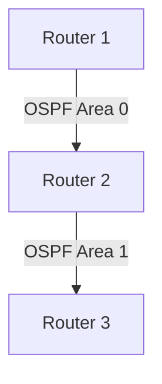

## Context
I was working on a multi-area OSPF deployment where neighbors weren’t forming adjacencies.

## The Problem
Routers were stuck in **ExStart** state.

```shell
R1# show ip ospf neighbor
Neighbor ID     Pri   State           Dead Time   Address         Interface
2.2.2.2           1   EXSTART/DR      00:00:32    10.0.0.2        Gig0/0
```

## The Investigation
Using `show ip ospf neighbor` on a cisco device, I noticed mismatched MTU settings between interfaces.

## Network Diagram


## The Root Cause
A mismatch in MTU prevented adjacency from forming.

## The Fix
Configured consistent MTU values across all routers.

```cisco
R1(config)# interface Gig0/0
R1(config-if)# ip mtu 1500
```

## The Lesson Learned
Always check MTU when OSPF neighbors get stuck in ExStart/Exchange state.
